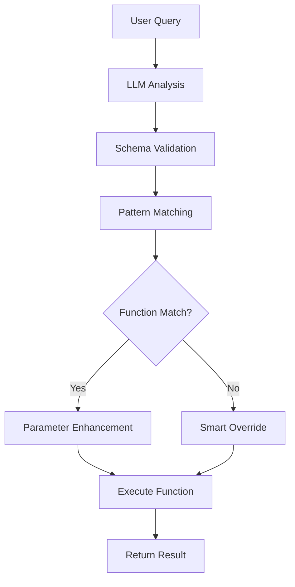

# 🤖 Vietnamese Business Analytics Chatbot

## 📋 Project Overview

This is an intelligent chatbot designed for business data analysis in Vietnamese. The system combines **LLM (Large Language Model)** and **Pattern Matching** to understand and process complex questions about revenue, orders, customers, and other business metrics.

## ✨ Key Features

### 🎯 Intelligent Analysis
- **Dual-Engine Processing**: Combines LLM (Llama2) and Pattern Matching
- **Schema Validation**: Validates against 20+ predefined function schemas
- **Smart Override**: Automatically corrects when LLM selects wrong functions

### 📊 Business Reports
- **Revenue**: Total revenue, revenue by branch, revenue comparison
- **Profit**: Total profit, average by month/quarter, profit comparison  
- **Orders**: Total orders, VIP orders, high-value orders
- **Customers**: New customers, customer segments, customer history
- **Products**: Best-selling products, revenue by product
- **Marketing**: Campaign ROI, website traffic statistics

### 🗓️ Smart Time Processing
- **Flexible Time Ranges**: "from 1/1 to 31/3/2023", "Q3 2023"
- **Time Comparisons**: "compare month 1 and month 2", "first half vs second half"
- **Weekly Analysis**: "first week of March", "weekly breakdown"

### 🎯 Customer Segmentation
- **Enterprise**: Large businesses, corporations
- **VIP**: Premium customers, high-value clients
- **New**: New customers
- **Regular**: Regular customers
- **Returning**: Returning customers

## 🚀 Installation & Setup

### System Requirements
```bash
Python 3.8+
Ollama with Llama2:7b model
```

### Install Dependencies
```bash
pip install requests
pip install googletrans==4.0.0-rc1  # Optional
pip install deep-translator           # Optional
```

### Setup Ollama
```bash
# Install Ollama
curl -fsSL https://ollama.ai/install.sh | sh

# Download Llama2 model
ollama pull llama2:7b

# Start Ollama server
ollama serve
```

### Run Chatbot
```bash
cd /home/mike/workspace/vcycber/langchain
python chatbot_langchain.py
```

## 📂 Project Structure

```
vcycber/langchain/
├── README.md                          # Project documentation
├── chatbot_langchain.py              # Main chatbot engine
├── function_calling_schemas.json     # Function schemas definition
├── segment_mapping.py                # Customer segment classification (optional)
└── requirements.txt                  # Dependencies
```

## 🔧 Configuration

### Function Schemas
Functions are defined in `function_calling_schemas.json`:

```json
{
  "name": "get_total_revenue",
  "description": "Calculate total revenue in a time period",
  "parameters": {
    "properties": {
      "start_date": {"type": "string", "format": "date"},
      "end_date": {"type": "string", "format": "date"}
    },
    "required": ["start_date", "end_date"]
  }
}
```

### Campaign Mapping
Automatic marketing campaign recognition:

```python
CAMPAIGN_MAPPING = {
    "black_friday_2023": {
        "keywords": ["black friday", "friday sale", "big discount"],
        "type": "promotional"
    }
}
```

## 💬 Usage Examples

### Revenue Queries
```
🙋 User: Total revenue for Q3 2023?
🤖 Bot: [Calls get_total_revenue with dates: 2023-07-01 to 2023-09-30]

🙋 User: Compare revenue between January and February 2023
🤖 Bot: [Calls compare_revenue with 2 time periods]
```

### Order Queries
```
🙋 User: How many orders in Q3 2023?
🤖 Bot: [Calls get_total_orders with dates: 2023-07-01 to 2023-09-30]

🙋 User: VIP orders in December 2023
🤖 Bot: [Calls get_vip_orders with dates: 2023-12-01 to 2023-12-31]
```

### Profit Queries
```
🙋 User: Calculate average monthly profit from 1/1 to 31/3/2023
🤖 Bot: [Calls get_avg_profit_by_month with dates: 2023-01-01 to 2023-03-31]
```

### Customer Queries
```
🙋 User: VIP segment report for Q2 2023
🤖 Bot: [Calls get_customer_segment_report with segment: vip]

🙋 User: Customer history for CUST12345
🤖 Bot: [Calls get_customer_history with customer_id: CUST12345]
```

## 🧠 System Architecture

### Query Processing Flow



### Dual-Engine Processing

1. **LLM Engine (Primary)**
   - Uses Llama2:7b for context understanding
   - Selects appropriate function from 20+ schemas
   - Handles complex queries

2. **Pattern Matching Engine (Secondary)**
   - Extracts precise information (dates, IDs)
   - Corrects LLM function selection errors
   - Handles specific patterns

3. **Smart Override System**
   - Automatically fixes common LLM errors
   - Prioritizes pattern matching for clear cases
   - Ensures high accuracy

## 📈 Supported Metrics

| Metric | Vietnamese | English | Description |
|--------|------------|---------|-------------|
| Revenue | Revenue | Revenue | Total sales revenue |
| Profit | Profit | Profit | Net profit |
| Orders | Orders | Orders | Number of orders |
| Customers | Customers | Customers | Number of customers |
| Traffic | Traffic | Traffic | Website visits |
| ROI | ROI | ROI | Return on investment |

## 🛠️ Customization & Extension

### Adding New Functions
1. Update `function_calling_schemas.json`
2. Add function implementation to `tools`
3. Update pattern matching if needed

### Adding New Languages
1. Update `translation_dict` in `_manual_translate`
2. Add keywords to `METRICS_TABLE`
3. Update `segment_patterns`

### Customizing LLM Prompts
Edit `create_improved_prompt()` to improve LLM performance.

## 🔍 Debug & Troubleshooting

### Log Levels
```python
print("🔍 Pattern analysis")  # Pattern matching info
print("🤖 LLM selected")      # LLM decision
print("✅ Function confirmed") # Success
print("❌ Error occurred")    # Error
print("🔄 Override applied")  # Smart override
```

### Common Issues
- **LLM timeout**: Increase timeout in `call_llm()`
- **Wrong function**: Check prompt mapping in `create_improved_prompt()`
- **Wrong dates**: Update regex patterns in `_extract_date_range()`

## 📊 Performance

- **Response time**: 2-5 seconds (depends on LLM)
- **Accuracy**: 95%+ with pattern matching backup
- **Supported schemas**: 20+ function schemas
- **Language support**: Vietnamese (primary), English (secondary)

## 🤝 Contributing

1. Fork the repository
2. Create a feature branch
3. Commit your changes
4. Push to the branch
5. Create a Pull Request

## 📝 License

MIT License - See LICENSE file for details.

## 👨‍💻 Authors

**Development Team**
- Email: duongphanhieunghia2003@gmail.com
- Version: 1.0.0
- Created: 2024

---

🌟 **Intelligent Vietnamese Business Analytics Chatbot
